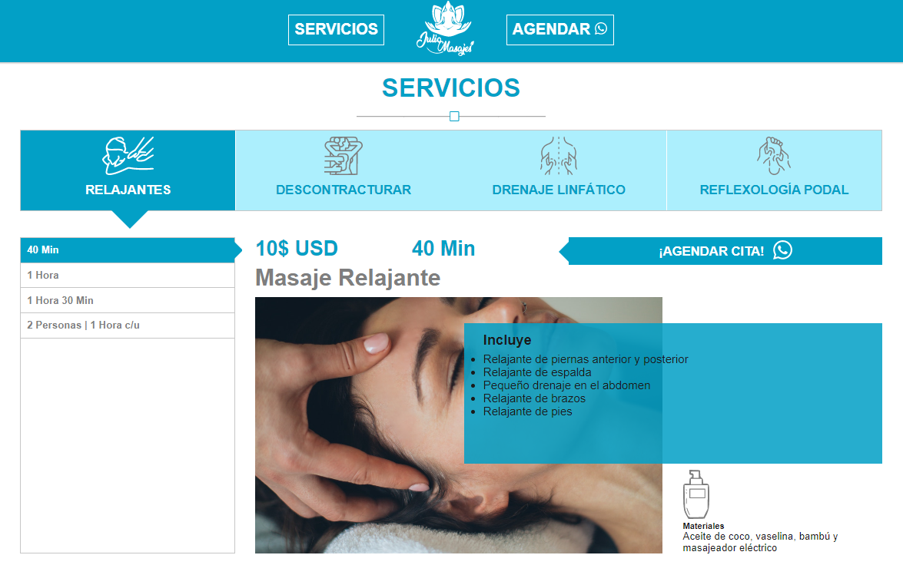
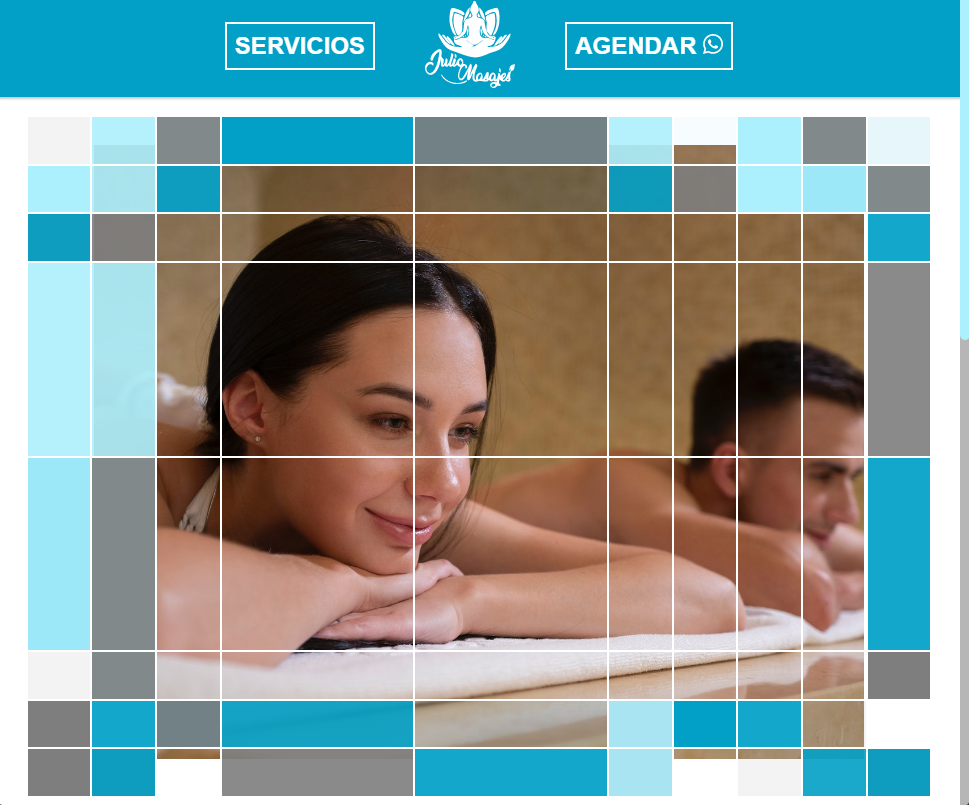

# Web Julio Masajes

## Descripción (Description) 📋

Landing Page de Julio Masajes, presenta sus servicios de masajes separados por categorías, duración y precios.

## Demostraciones (Demos)  :kiss:

Con mucho gusto puedes consultar una demostración funcional de la [Landing Page diseñada para Julio Masajes](https://achique-luisdan.github.io/web-julio-masajes/)  [¡Visitar!](https://achique-luisdan.github.io/web-julio-masajes/)

## Características (Features) ❤️

*  Sección principal muestra una foto llamativa, con pequeños recuadros animados que cambien de color, brindándole a la web un aire creativo y profesional.

* Muestra de forma dinámica servicios agrupados por categorías: Relajantes, Descontracturantes, Drenajes Linfáticos y Reflexología Podal.

* Diseño adaptativo a dispositivos tales como ordenadores de escritorio, laptops y móviles.

* Cuenta con iconos representativos de cada categoría de servicios.

* Enlaces a redes sociales: Facebook, WhatsApp, Instagram.

* Paleta de colores acorde a su marca personal.

## Herramientas (Tools) 🛠️

* HTML5 (Semántico)

* CSS3 (Selectores, Grid Layout, CSS Flexbox)

* JavaScript (Vanilla o Puro)

## Equipo (Team) ✒️

A continuación se menciona a todos aquellos que ayudaron a levantar el proyecto desde sus inicios:

* **Luis Achique** - *Desarrollador Web* - [GitHub: @achique-luisdan](https://github.com/achique-luisdan)

## Reseñas (Reviews) 💞
<section align="center">

<a href="https://julio-masajes.web.app/"><b>Julio Alvarez</b></a>

<b>Dueño</b>

<b>Julio Masajes</b>

</section>

De verdad estoy súper contento y agradecido por tu exelente trabajo. Me quedé impresionado por mi página web. Me encantó. Excelente trabajo hermano. Todo perfecto. Súper agradecido contigo. Muy profesional.
